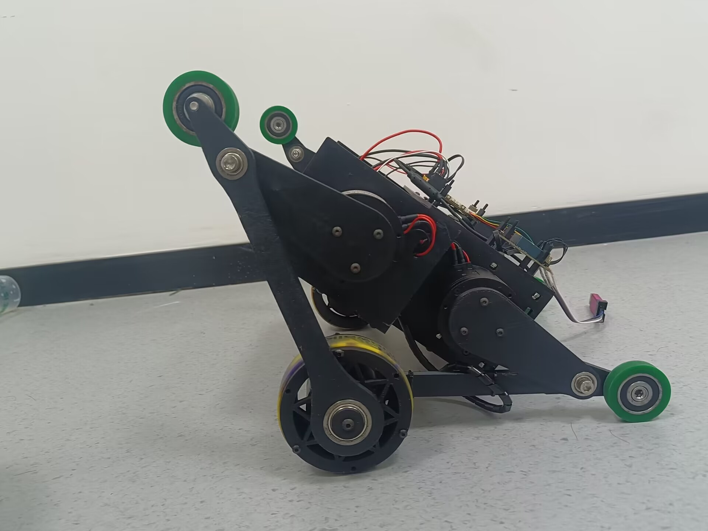
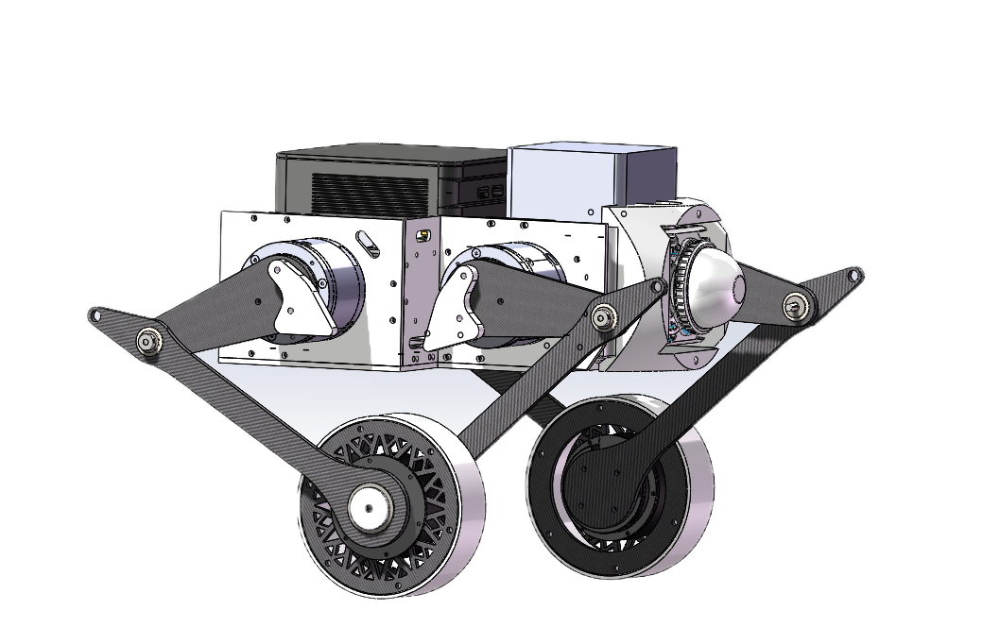
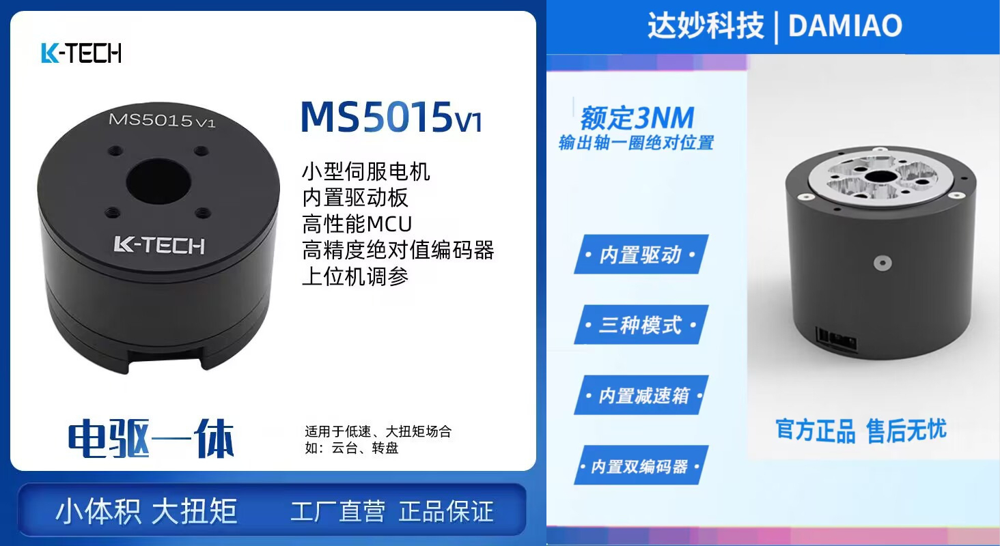
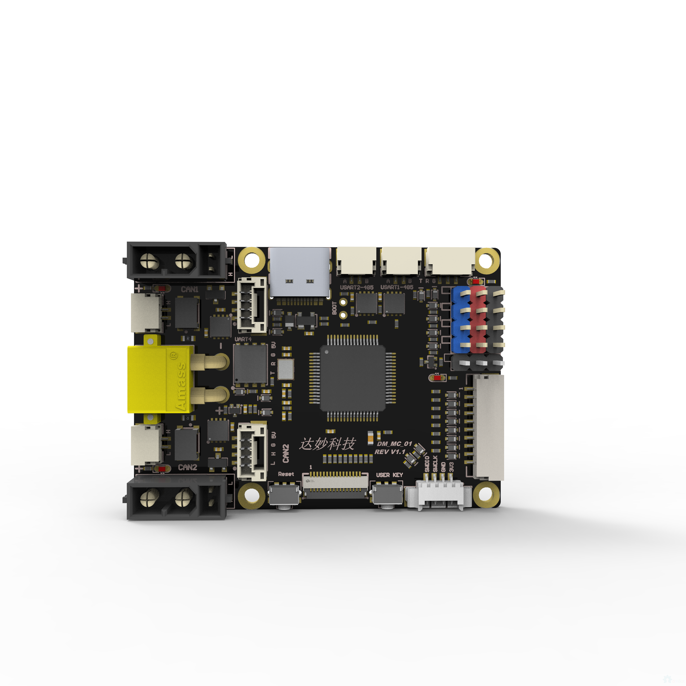
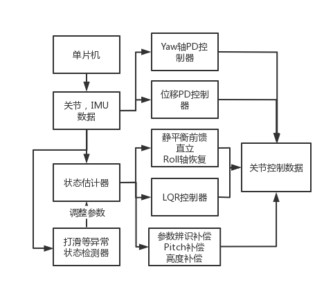
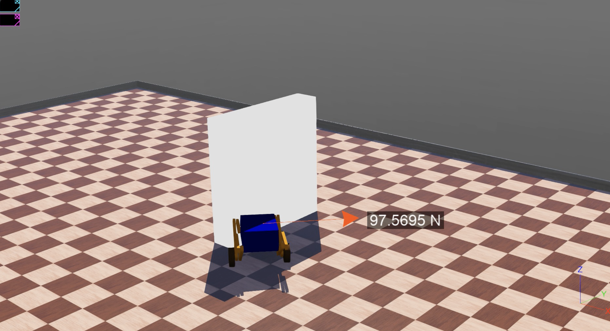

# 基于五连杆轮腿的高性能深空探测机器人平台

### 队名：大蜀山孺子牛火星分牛

### 队员：邵宜阳 PB21050946 张昊鹏 PB21050991 卢星宇 PB21061239

# 项目简介

“人类的目标是星辰大海”。但是外星环境崎岖复杂，又广袤无际。对一些行星进行探索时，如何兼顾探索的效率与地形适应性是个值得思考的问题。在空气稀薄的行星上，无人机将无法起飞，而燃料式飞行器的消耗不利于长期的探索，我们只能寄托希望在地面探测车上。为了应对复杂的地形、恶劣的路况，行星探测车必须配有多轮的具有可抬升底盘，可这不可避免地增加了的质量和尺寸。一台月球车可能需要由比它重 300 倍的运载火箭发射，尽管多轮探测车稳定可靠，但在追求 **“质量轻，体积小，功耗低”** 航空领域显得格格不入。如何做到“轻、小、低”又如何实现原有的稳定可控的探测效果是我们本次的课题。

为实现“质量轻，体积小，耗功低”的目标，只有两个轮子，具有灵活运动能力的轮腿式平衡式机器人引起了我们的关注。相较多轮探测车，轮腿式平衡车更轻量小巧，拥有原地旋转的能力，可以避免在小空间中易进难出的困局。相较普通两轮平衡车，轮腿式平衡中腿的结构形成了天然的悬挂，可以通过调整腿的高度具有极强的越障能力，在引力较弱的环境，会极大提升腿式结构的跳跃性能，能前往普通轮式探测车无法到达的空间进行探索。

为此我们开展了六自由度轮腿式地形自适应高速移动机器人的开发，希望能够设计出六自由度轮腿式平台，为轮腿平台的三维路径规划算法提供试验平台，希望在整个项目完善之后能够为类地行星探索提供一套优越的方案。

下面，我们将从**机械**、**电控**、**控制算法**三个方面介绍我们的项目面向深空探测所做的探索。

# 机械部分——轻量化、低成本、快速制造

为了减小车辆的质量，提高载重能力，我们采用五连杆设计，并通过经过matlab计算优化的设计尺寸比例确保了运动空间的情况下实现了关节角度和底盘高度的高线性性。高线性性这个特点对降低之后算法的线性化误差意义很大。

在成为深空探测车之前，我们希望轮腿式平台可以以较低的成本制造，能够让更多的人能够拥有并参与到改进中来，甚至成为入门机械、电控、导航算法的教学平台。为此，我们使用 3D 打印构建了我们的车身，只要有一台 3D 打印机，一天内能够完成一次设计方案的迭代更新完成制造。3D 打印耗材的降低了试错的成本，3D 打印技术可以打印近乎任何形状的零件，使得设计方案有极强的灵活性。

手环胶轮更是本低成本设计方案的亮点，CNC 金属轮子并包胶需要大量人工且成本极高，我们选择了使用 3D 打印的圆筒和侧板，并使用机器人社团的纪念品手环作为胶面。价值 3 元的手环和一个 3D 打印的轮毂性能却和昂贵的包胶轮不相上下，而且因为手环可以伸缩，可以轻松改变轮子的直径，面向不同的路况。

然而，和胶轮一样，在地面较脏的情况下可能会出现**打滑**，当轮子打滑的时候，要如何维持车辆的平衡呢？这个问题我们将在算法章节探讨。

# 电路部分——小型化、定制化

为了使得整个探测器小巧轻量，各个部件的选型也必须小型化，并需要自行设计一些部件来适配车体大小。

## 电机

关节电机使用达妙 Z4310,使用 MIT 模式控制，可以同时控制电机的力矩、速度和位置。

轮毂电机使用翎控 MF5015,通过运动解算来控制电机的力矩（电流）。

### 供电

供电方案是使用 24V 电池，经过自行设计的电机分电板进行供电。达妙 STM32 开发板具有 24V 供电输入，因此不需要额外考虑降压部分。

一代分电板可以接收 24V 输入并转接成电机的排线，分电板会发出蓝色灯光，增加科技感。

二代分电板增加了缓启动保护和反向电压抑制功能，以保护电机和上游设备。

# 电控底层部分——实时化、上位机协同

本电控系统由 STM32F446RCT6 微控制器和可扩展的上位机组成，实现了对 6 个电机的实时控制。通过 CAN 总线，STM32 以 1000Hz 的频率执行基于 MIT 控制方案，从而高精度跟踪上位机的 MPC 算法结果。STM32 通过串口扩展了一个陀螺仪，计算频率为 400Hz，并配备自适应滤波器。微控制器与上位机的通信基于 USB 协议，相较于传统的 SPI 通信，此方案拥有更高的带宽和更广的上位机选择范围。

#### STM32 实时控制器

我们选用 STM32F446RCT6 微控制器，由达妙科技制造。

该控制器的功率输出通过 mos 管实现开关，因此我们可以在重启微控制器时重启电机，实现电机的初始化。

STM32 具备多重保护功能，包括电机离线保护、陀螺仪离线保护和上位机离线保护。只有当电机和陀螺仪均在线时，微控制器才会进入控制模式。此外，微控制器会检测上位机的活跃状态，如果上位机失活，微控制器将接管电机控制并切换到阻尼模式以最大程度保护车体。

#### 上位机高兼容性

我们的轮腿平台上位机只需具备 USB 接口即可。因此，所有的笔记本、主机和嵌入式 Linux 开发板都可以满足需求。

#### 基于 ROS2 的上位机框架

我们为轮腿平台的上位机开发了基于 ROS2 的底层框架，包括调试信息显示、车体状态展示、多种编程语言支持环境和自定义数据类型。

我们选用了 ROS2 的最新长期支持版本——ROS2 Humble 作为通信平台，它支持几乎所有的操作系统，其中甚至包括 Windows。其基于 DDS 实现的底层通信可方便地进行局域网扩展，为未来扩展实时上层运动规划器甚至多机协作创造了条件。

# 控制算法部分——鲁棒性

轮足式机器人在结构上最显著的优势在于高度可变的两条轮足带来的地形适应能力与高速移动能力，而这有赖于能根据地形灵活调整姿态、保持平衡、稳定运动的控制算法。因此，我们构建了轮足式机器人的虚拟动力学模型。相较于手动调参传统的 pid 算法，我们基于模型，设计 LQR 和 MPC 控制算法，能够有更好的平衡稳定性，也便于适配不同星球的环境参数如重力加速度。

#### 经过计算的腿长参数

与普通的轮式平衡相比，经过算法优化的五连杆平衡车可以通过调整腿部姿势来实现更好的平衡效果，并获得更大的通过性。为了实现较为线性的物理特性，方便使用线性控制器进行控制，腿的长度参数设置为关机电机之间距离：大腿长度：小腿长度=10：8：16。

#### 基于动力学模型可控控制

比起传统的 pid 控制算法，基于模型的控制更科学可靠。

为了简化动力学建模的过程，并使控制算法的输入与输出更易于理解，我们将机器人的闭合五连杆模型简化为可伸长杆的虚拟模型，并依此建立虚拟动力学模型

**参数定义**

我们使用四个参数$x,y,\theta ,\varphi$及其导数描述系统

系统状态向量即为$\bold s = [\dot x~ y~\dot y ~\theta ~\dot \theta~ \varphi~\dot\varphi]$，也为系统的广义坐标

控制量即为$\bold u=[M_1~M_2~F]$

**推导过程**

首先，构建拉格朗日量：

$$tex
T = \frac 1 2 (m_1 + m_2)\dot x^2 + \frac 1 2 J_2 (\frac {\dot x} R)^2 + \frac 1 2 J_1\dot \theta^2 + \frac 1 2 J_0\dot \phi^2 + \frac 1 2 m_0\left[(\dot x - y\dot \theta\cos\theta - h\dot\varphi\cos\varphi - \dot y\sin\theta)^2 + (\dot y\cos\theta - y\dot \theta\sin\theta - h\dot\varphi\sin\varphi)^2 \right]\\=\frac 1 2 (m_0 + m_1 + m_2 + \frac{J_2}{R^2})\dot x^2+\frac 1 2J_0\dot\varphi^2+\frac 1 2J_1\dot\theta^2+\frac 1 2 m_0\left[\dot y^2+y^2\dot\theta^2+h^2\dot\varphi^2 - 2\dot x(y\dot\theta\cos\theta+h\dot\varphi\cos\varphi)+2h\dot\varphi\left(y\dot\theta\cos(\theta-\varphi)+\dot y\sin(\theta-\varphi)\right)\right]\\
$$

$$
V = m_0g(y\cos\theta+h\cos\varphi)\\
$$

$$
L = T - V
$$

其次，根据拉格朗日第二定律得到原始动力学方程：

$$
\frac{\mathrm d }{\mathrm d t}(\frac{\partial L}{\partial \dot x}) - \frac{\partial L}{\partial x} = Q_x\\\Rightarrow {m_0} \left(-h {\varphi}'' \cos ({\varphi})+h {\varphi}'^2 \sin ({\varphi})-{\theta}' \cos ({\theta}) y'+y \left({\theta}'^2 \sin ({\theta})-{\theta}'' \cos ({\theta})\right)\right)+x'' \left(\frac{{J_2}}{R^2}+{m_0}+{m_1}+{m_2}\right)= -\frac {M_2} R
$$

$$
\frac{\mathrm d }{\mathrm d t}(\frac{\partial L}{\partial \dot y}) - \frac{\partial L}{\partial y} = Q_y\\\Rightarrow {m_0} \left(g \cos ({\theta})-h {\varphi}'' \sin ({\varphi}-{\theta})-h {\varphi}'^2 \cos ({\varphi}-{\theta})+\cos ({\theta}) {\theta}' x'-y {\theta}'^2+y''\right)= F
$$

$$
\frac{\mathrm d }{\mathrm d t}(\frac{\partial L}{\partial \dot \theta}) - \frac{\partial L}{\partial \theta} = Q_\theta\\\Rightarrow -{m_0} y \left(g \sin ({\theta})-h {\varphi}'' \cos ({\varphi}-{\theta})+h {\varphi}'^2 \sin ({\varphi}-{\theta})-2 {\theta}' y'+\cos ({\theta}) x''\right)+{J_1} {\theta}''+{m_0} y^2 {\theta}''-{m_0} \cos ({\theta}) x' y'= M_1 - M_2
$$

$$
\frac{\mathrm d }{\mathrm d t}(\frac{\partial L}{\partial \dot \varphi}) - \frac{\partial L}{\partial \varphi} = Q_{\varphi}\\\Rightarrow -g h {m_0} \sin ({\varphi})+h^2 {m_0} {\varphi}''+2 h {m_0} {\theta}' y' \cos ({\varphi}-{\theta})+h {m_0} y \left({\theta}'' \cos ({\varphi}-{\theta})+{\theta}'^2 \sin ({\varphi}-{\theta})\right)-h {m_0} y'' \sin ({\varphi}-{\theta})-h {m_0} \cos ({\varphi}) x''+{J_0} {\varphi}'' = -M_1
$$

进而在平衡点附近略去高阶销量并线性化

$$
\frac{(m_0+m_1+m_2+\frac{J_2}{R^2})}{m_0}\ddot x-y_0\ddot \theta- h\ddot \varphi = -\frac {M_2} {m_0R}\\
$$

$$
\ddot y= \frac F {m_0} - g
$$

$$
-y_0 \ddot x+(\frac{J_1}{m_0}+y_0^2)\ddot \theta+hy_0\ddot\varphi=\frac{M_1-M_2}{m_0}+gy_0\theta
$$

$$
-h\ddot x+hy_0\ddot \theta+(\frac{J_0}{m_0}+h^2)\ddot \varphi=-\frac{M_1}{m_0}+gh\varphi
$$

整理得到

$$
\begin{bmatrix} \frac{m_0+m_1+m_2+J_2/R^2}{m_0} & 0 & 0 & 0 & -y_0 & 0 & -h\\ 0 & 1 & 0 & 0 & 0 & 0 & 0\\ 0 & 0 & 1 & 0 & 0 & 0 & 0\\ 0 & 0 & 0 & 1 & 0 & 0 & 0\\ -y_0 & 0 & 0 & 0 & (J_1/m_0+y_0^2) & 0 & hy_0\\ 0 & 0 & 0 & 0 & 0 & 1 & 0\\ -h & 0 & 0 & 0 & hy_0 & 0 & (J_0/m_0+h^2)\end{bmatrix}\begin{bmatrix}\ddot x \\\dot y \\\ddot y \\\dot \theta \\\ddot \theta \\\dot \varphi \\\ddot \varphi \end{bmatrix} = \begin{bmatrix} 0 & 0 & 0 & 0 & 0 & 0 & 0\\ 0 & 0 & 1 & 0 & 0 & 0 & 0\\ 0 & 0 & 0 & 0 & 0 & 0 & 0\\ 0 & 0 & 0 & 0 & 1 & 0 & 0\\ 0 & 0 & 0 & gy_0 & 0 & 0 & 0\\ 0 & 0 & 0 & 0 & 0 & 0 & 1\\ 0 & 0 & 0 & 0 & 0 & gh & 0\end{bmatrix}\begin{bmatrix}\dot x \\ y \\\dot y \\\theta \\\dot \theta \\\varphi \\\dot \varphi \end{bmatrix}+\begin{bmatrix} 0 & -\frac 1 {m_0R} & 0\\ 0 & 0 & 0\\ 0 & 0 & \frac 1 {m_0}\\ 0 & 0 & 0\\ \frac 1 {m_0} & -\frac 1 {m_0} & 0\\ 0 & 0 & 0\\ -\frac 1 {m_0} & 0 & 0\end{bmatrix}\begin{bmatrix}M_1 \\M_2 \\F\end{bmatrix}+\begin{bmatrix}0 \\0 \\-g \\0 \\0 \\0 \\0\end{bmatrix}
$$

此结论可记作

$$
C\dot {\bold s} = A \bold s + B\bold u + \bold g
$$

**LQR 控制算法**

为美观起见下面用$\bold s$表示状态向量与期望值的误差。

LQR(Linear Quadratic Regulator)算法本质上为最优化 PD 控制器，其要求控制律为

$$
\bold u=K\bold s - B^{-1}\bold g\\
$$

于是可以得到

$$
\dot {\bold s}=(A+BK){\bold s}\\

$$

对角化

$$
A+BK=T^{-1}DT\\
$$

设特征值为$\lambda_i,i\in\{1,2,\dots,7\}$，得到

$$
\bold s=T^{-1}e^{Dt}T \bold s_0\\
$$

其中 e^{Dt}为对角阵，对角线上元素分别为$e^{\lambda_i t},i\in\{1,2,\dots,7\}$

为了实现最优控制，定义代价函数

$$
J=\int_0^{+\infty}(\bold s^{\top}Q\bold s+\bold u^{\top}P\bold u)\mathrm dt
$$

其中$Q$为半正定对角阵$(Q=H^{\top}H)$，$P$为正定对角阵。对于我们的线性动力系统，基于$\mathrm{Hamilton-Jacobi-Bellman}$定理，求解$\mathrm{Riccati}$代数方程即可确定最优反馈系数矩阵$K=\argmin(J(K))$

**MPC 控制算法**

MPC（Model Predictive Control）是一种优化基础的控制策略，其基本思想是在每个控制步骤中，都假设系统模型和当前的状态是已知的，并且预测未来的系统行为。然后，根据这些预测，计算一组优化的控制输入使得预期的性能指标最优化。具体来说，

设系统动力学为

$$
\bold s_k=A\bold s_{k-1}+B\bold u_{k-1}\\
$$

其中$\bold s_k$为状态向量，$\bold u_k$为控制输入。

MPC 策略首先在预测空间构建一个优化问题：

$$
\min_{\bold u} \sum_{k=0}^{N-1} (s_k^{\top}Qs_k+u_k^{\top}Ru_k) + s_N^{\top}P_fs_N\\
$$

其中$Q$和$R$是权重矩阵，$N$是预测步长，$P_f$是终端状态权重矩阵。

然后，通过求解约束优化问题

$$
\begin{aligned}
& \text{minimize} & & \sum_{k=0}^{N-1} (s_k^{\top}Qs_k+u_k^{\top}Ru_k) + s_N^{\top}P_fs_N \\
& \text{subject to} & & s_{k+1}=As_k+Bu_k, \quad k = 0,\ldots,N-1 \\
& & & s_0=s(t), u_k\in\mathcal{U}, s_k\in\mathcal{s}
\end{aligned}
$$

得到最优控制序列$\bold u^*=(u_0^*,\dots,u_{N-1}^*)$。然后，只应用最优序列的第一个控制输入$u_0^*$到系统。在下一个时刻，重复这个过程，这就是所谓的重复优化。

整个过程可以通过各种数值优化技术来求解，例如二次规划(QP)或线性规划(LP)等。MPC 的主要优点是它可以直接处理多输入多输出(MIMO)系统，处理约束，并且可以处理非线性和不确定性。

#### 8自由度状态观测器

通过用卡尔曼滤波器实现状态观测器，我们可以融合电机反馈的速度、位置和陀螺仪反馈的角速度得到滤波后较为精确的车体状态。

$状态向量定义：X = [x~\dot x~y~\dot y~\theta~\dot \theta~\varphi~\dot\varphi]^\top$

$$
X_{k}= \begin{bmatrix}
 1&dt & & & & & & \\
 & 1& & & & & & \\
 & & 1&dt & & & & \\
 & & & 1& & & & \\
 & & & & 1& & & \\
 & & & & & 1& & \\
 & & & & & & 1& \\
 & & & & & & &1
\end{bmatrix}X_{k-1} + \begin{bmatrix}
 0 &0 \\
 1 & 0\\
 0 &0\\
 0 & 1\\
 0 &0\\
 0 &0 \\
 0 &0 \\
 0 &0
\end{bmatrix}\begin{bmatrix}
 \ddot{x}_{k-1} \\

\ddot{y}_{k-1}
\end{bmatrix} + \omega \\
\\
Y_{k} = X_{k}= IX_{k} + V_{k}=\begin{bmatrix}
\theta_{Motor} R_{wheel} \\
\omega_{Motor} R_{wheel} \\
y_{五连杆解算}\\
 \dot{y}_{五连杆解算}\\
R_{IMU}\theta_{五连杆解算} \\
 \dot{R}_{IMU}\theta_{五连杆解算} + R_{IMU}\dot{\theta}_{五连杆解算}\\
 R_{IMU}I \\
 \dot{R}_{IMU}I
\end{bmatrix}
$$

$$
R为IMU旋转矩阵\\
w = \begin{bmatrix}
w_x &w_y &w_z
\end{bmatrix}^{T} \\
w^{\Lambda } = \begin{bmatrix}
0 &-w_z &w_y\\
w_z &0 &-w_x\\
-w_y &w_x &0
\end{bmatrix}\\
\dot{R}_{IMU}=\frac{\mathrm{d} R}{\mathrm{d} t} =w^{\Lambda }R
$$

$$
对于二维情况\\
w = \begin{bmatrix}
0  &0  &w_z
\end{bmatrix}^{T} \\
w^{\Lambda }  = \begin{bmatrix}
0  &-w_z\\
w_z &0 
\end{bmatrix}\\

R = \begin{bmatrix}
\cos{\phi}  &-\sin{\phi}\\
\sin{\phi} &\cos{\phi} 
\end{bmatrix}\\
\dot{R}_{IMU}=\frac{\mathrm{d} R}{\mathrm{d} t} =w^{\Lambda }R
$$

$$
\frac{\partial \theta}{\partial \alpha_1} = \frac{\text{lt} \sin(a_1 - a_3) \sin(a_4 + \varphi - \theta)}{h \sin(a_3 - a_4)} \\\frac{\partial \theta}{\partial \alpha_2} = \frac{\text{lt} \sin(a_2 - a_4) \sin(a_3 + \varphi - \theta)}{h \sin(a_3 - a_4)} \\\frac{\partial y}{\partial \alpha_1} = -\frac{\text{lt} \sin(a_1 - a_3) \cos(a_4 + \varphi - \theta)}{\sin(a_4 - a_3)} \\\frac{\partial y}{\partial \alpha_2} = \frac{\text{lt} \sin(a_2 - a_4) \cos(a_3 + \varphi - \theta)}{\sin(a_4 - a_3)}
$$

### 基于卡尔曼滤波器的打滑处理

当探测器在有粉尘的行星表面探索时，**打滑**是不可避免的。打滑的发生会严重地影响车体的平衡，于是我们进行了打滑检测并基于卡尔曼滤波器进行了打滑处理。

已知车轮打滑时，两个轮子最低点不会相对静止。我们可以根据上述模型计算轮子在地面系下轮子的运动速度，当轮子速度偏离期望超过阈值时，就判定车轮打滑。平时我们通过卡尔曼滤波器融合轮子速度和陀螺仪加速度，此时我们加大卡尔曼滤波器中轮子速度的噪声权重，减小计算中对轮子速度的依赖，使我们测得的车体运动状态更加依靠加速度积分得到，保证了运动模型状态的正确，减小打滑对车辆控制造成的影响。

实现了以上功能，机器人一侧的腿即便突然离地，落地后仍然能够保持平衡。

# 验证——Sim2Real

为了保证设计的正确性，我们现在仿真平台下进行了验证，在验证可靠性后，我们再在实体上测试。

### 仿真环境介绍

我们使用 webots2023 进行机器人动力学仿真，仿真环境如图所示：

lqr 和 mpc 均在仿真环境中取得了良好的效果

[MPC_Recovery](./Photos/Report_DeepSky/MPC.mp4 ':include :type=video controls width=100%')

## 实际验证

我们在实际机器人上部署了 LQR 控制算法，发现实际机器人控制的效果仍有极大提升空间。经分析，我们还有以下几个方面需要改进：

- 机械结构：由于关节连接处虚位较大，加之3D打印腿的强度不足，我们设计了第二版基于碳纤维和低虚位的腿部结构，这将提高腿部的整体刚度和车体稳定性。

- 需要引入模型全参数辨识系统，在线修正参数误差，更加适应多变的外太空探测环境

- 需要实现倒地恢复功能，在发生碰撞倒地后进行自救。

- 需要实现离地姿态控制，以实现跳跃功能

目前，我们仍然持续进行开发，尽请期待。

# 总结

我们的项目目标是开发一款能在行星地表中进行高效探索的六自由度轮腿式地形自适应高速移动机器人平台。并面向深空探测设计需要，在机械设计、电控系统和控制算法三个方面进行了深入研究和实践。

在机械设计部分，我们以 3D 打印件为主体，创新性地采用了手环胶轮，保证了探测器所需的轻量化，采用五连杆设计，提高了复杂地形下的可通过性。

在电控系统部分，我们使用了 STM32F446RCT6 微控制器和可扩展的上位机，实现了对 6 个电机的实时控制。我们还开发了基于 ROS2 的上位机框架，支持多编程语言环境和自定义数据类型，为未来可能的扩展提供了便利。

在控制算法部分，我们构建了轮足式机器人的虚拟动力学模型，依次设计了 LQR 和 MPC 控制算法，并在仿真和实车上验证。为了实现较好的鲁棒性，减少打滑的危害，能够在更多样的地面进行探索，我们利用车体模型和卡尔曼滤波噪声权重，实现了优雅的打滑处理。

通过这个项目，我们设计并实现了鲁棒性好，运动性强，负载高，框架扩展性好的移动机器人平台，为未来的路径规划和自主探索算法开发提供了良好的支持。我们相信，通过持续优化和改进，我们的机器人平台将能够在深空探测中脱颖而出。
